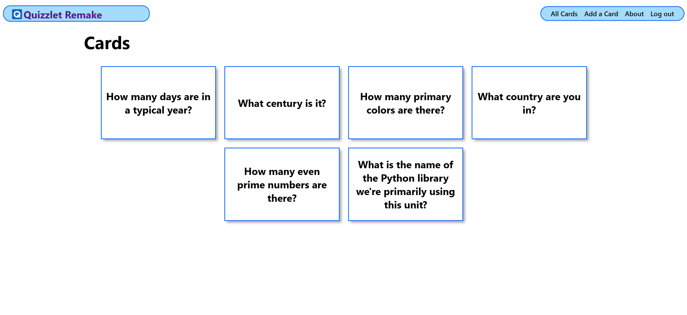

# Quizzlet Remake
I chose to make a stripped down version of Quizzlet because for project 1, someone made memory match and animated their cards flipping. I wanted to make something that had action like that, while still staying manageable to create amidst low motivation.

## Getting started
You can find the [deployed site here](https://quizzlet-remake-0f553a9e2662.herokuapp.com/)

Planning materials [can be found here](https://trello.com/b/BFAK3Tbb/quizzlet-remake)

## Attributions
 ### Class notes and labs
 -  This application takes heavy inspiration from the catcollector lecture project, especially regarding most of the CSS

## Sources
Images were used from:
 - [Favicon / Logo](https://icons8.com/icons/set/quizlet)

## Technologies Used: 
1. **Django**
2. **Python**
3. **PostgreSQL**
3. **Javascript**
4. **HTML**
5. **CSS**

## Stretch Goals
Theres a few things I would like to add to my website to make it more functionally complete

1. **Allow for better categorization and organization of the quiz cards**
    * Creating a "subject" or "class" which contains a set of cards for more focused studying.
2. **More styling**
    * The current styling on the site is for MVP, there are many small improvements that could be made for a more sleek user experience
